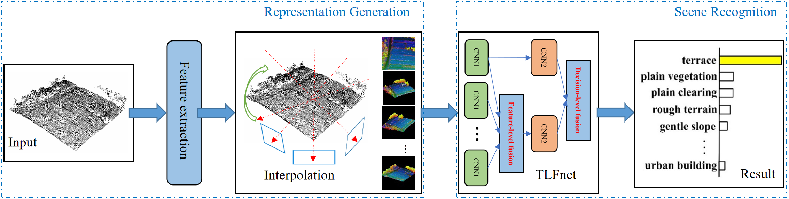
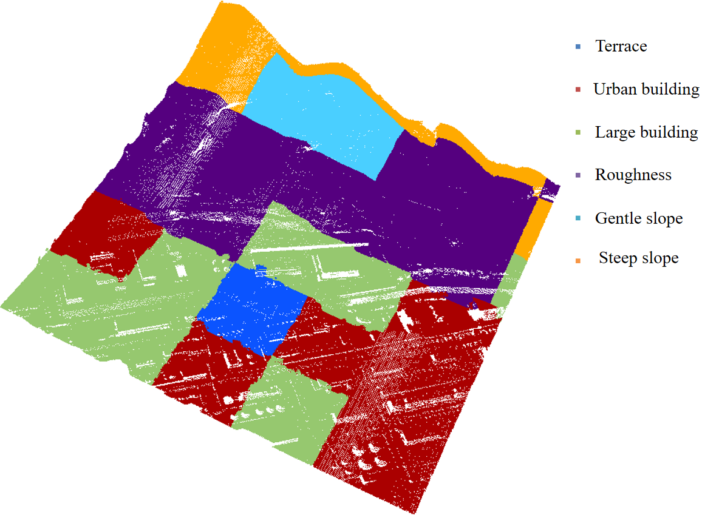
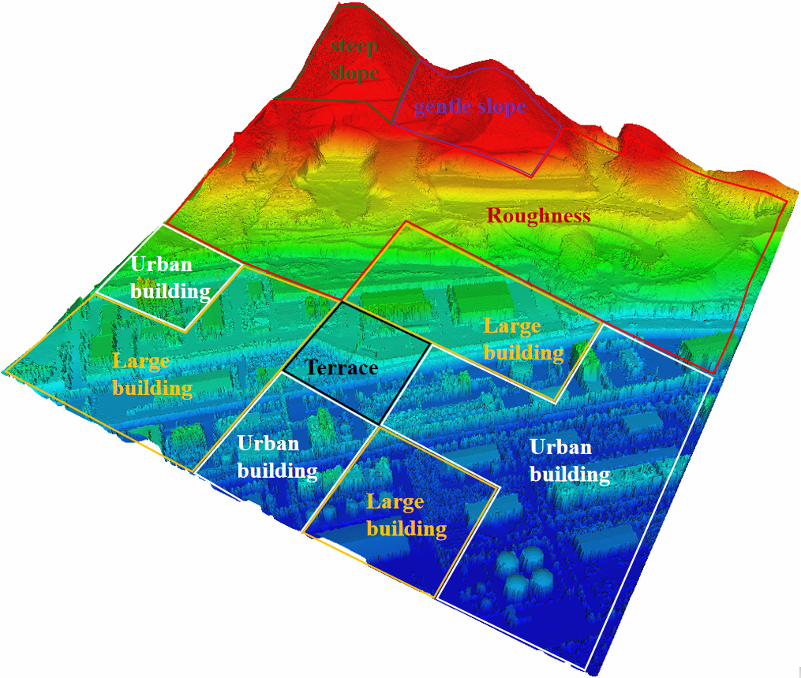

# Deep fusion of multi-view and multimodal representation of ALS point cloud for 3D terrain scene recognition

**Deep fusion of multi-view and multimodal representation of ALS point cloud for 3D terrain scene recognition** 

Nannan Qin, Xiangyun Hu*, Hengming Dai

**[[Paper](https://doi.org/10.1016/j.isprsjprs.2018.03.011)]**

# Abstract
Terrain scene category is useful not only for some geographical or environmental researches, but also for choosing suitable algorithms or proper parameters of the algorithms for several point cloud processing tasks to achieve better performance. However, there are few studies in point cloud processing focusing on terrain scene classification at present. In this paper, a novel deep learning framework for 3D terrain scene recognition using 2D representation of sparse point cloud is proposed. The framework has two key components. (1) Initially, several suitable discriminative low-level local features are extracted from airborne laser scanning point cloud, and 3D terrain scene is encoded into multi-view and multimodal 2D representation. (2) A two-level fusion network embedded with feature- and decision-level fusion strategy is designed to fully exploit the 2D representation of 3D terrain scene, which can be trained end-to-end. Experiment results show that our method achieves an overall accuracy of 96.70% and a kappa coefficient of 0.96 in recognizing nine categories of terrain scene point clouds. Extensive design choices of the underlying framework are tested, and other typical methods from literature for related research are compared.

# Framework

# Experiment
(1) Point Cloud in mixed scenes

(2) Recognition result

(3) Recognition result

## Citation
If it is helpful for your work, please consider citing our paper:

    @article{QIN2018205,
        title = {Deep fusion of multi-view and multimodal representation of ALS point cloud for 3D terrain scene recognition},
        author = {Nannan Qin and Xiangyun Hu and Hengming Dai},
        journal = {ISPRS Journal of Photogrammetry and Remote Sensing},
        year = {2018},
        volume = {143},
        pages = {205-212},
    }
